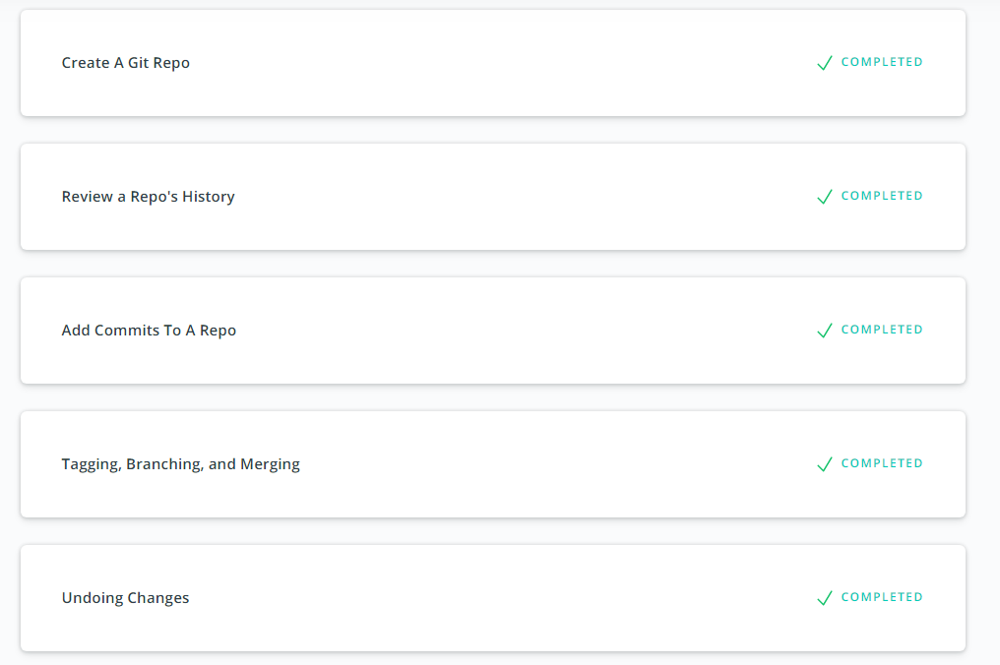

1. [x]  Finish the course [Version Control with Git](https://www.udacity.com/course/version-control-with-git--ud123)
2. [x] Finish [try.github.io](https://learngitbranching.js.org/) .
3. [x]  Create repository named `kottans-frontend`.
4. [x]  Create `README.md` for the repository.

5. [x] My impressions about learned material:
 
 I added some new git commands to my toolkit:
 * git rebase
 * git fetch
 * git pull
 * git push
 * git log with some flags (--oneline --graph --all is the best)
 P.S. Actually, git pull = git fetch +git merge .
 
6. [x] Send a pull-request to Kottans/mock-repo
7. [x] Viewed some extra materials 
 
 And you can find some screenshots below :)
 
 
 
