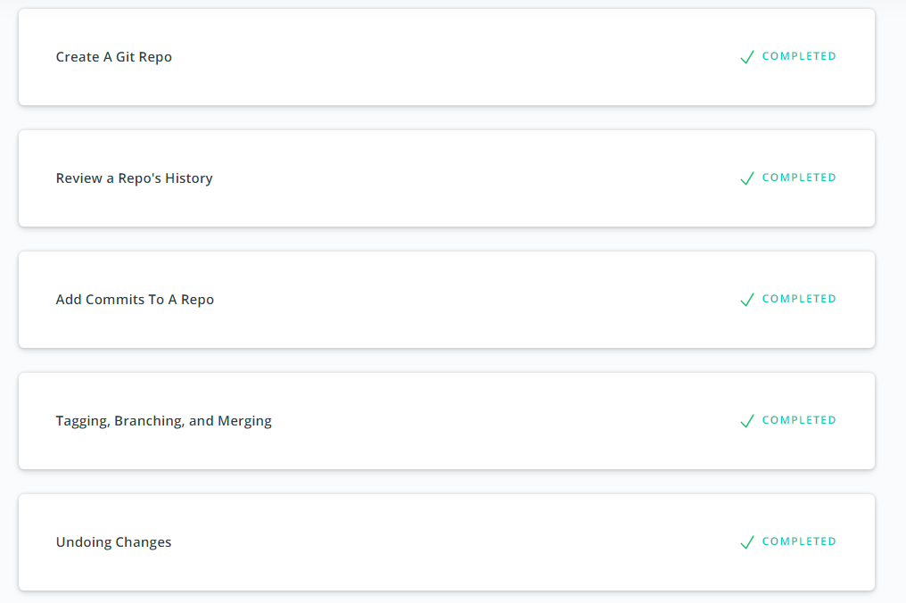
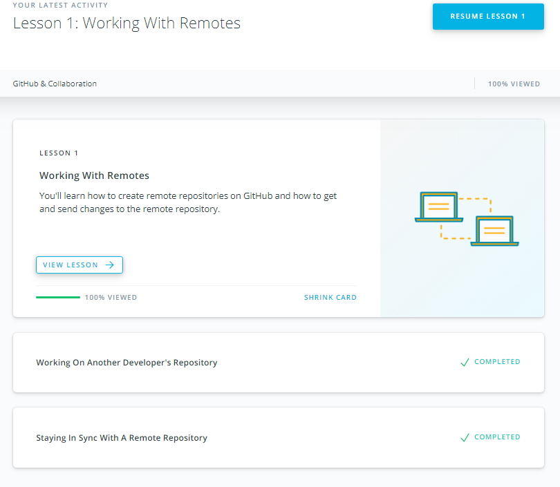

# Git for Team Collaboration

1. [x] Finish the courses [What is Version Control](https://classroom.udacity.com/courses/ud123/) and [GitHub & Collaboration](https://classroom.udacity.com/courses/ud45)

### My expressions about the courses:

The contributing part was very insightful. Also, for the record, git rebase command is so powerful.
You can edit, squash,remove commits with only one command.
And I finished the basic part of the frontend course, hell yeah!!

Screenshots:

