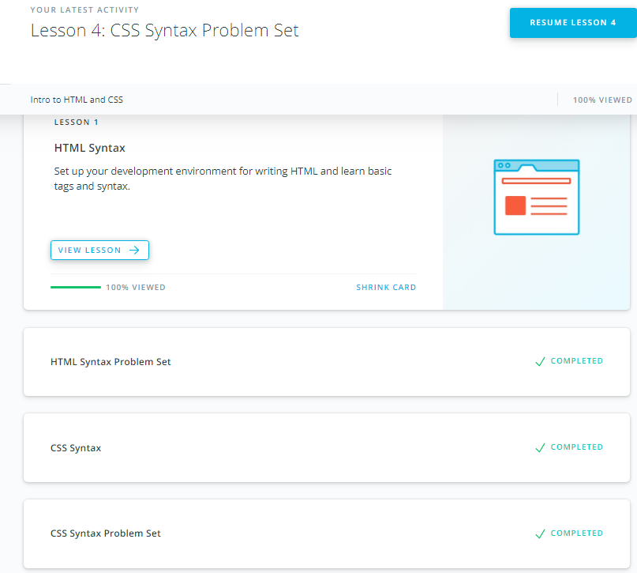
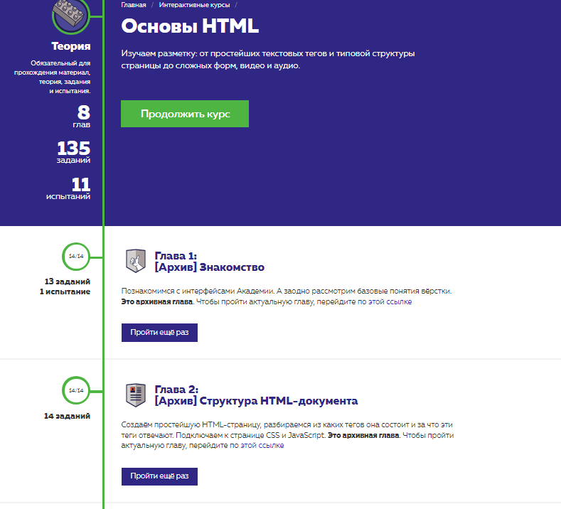
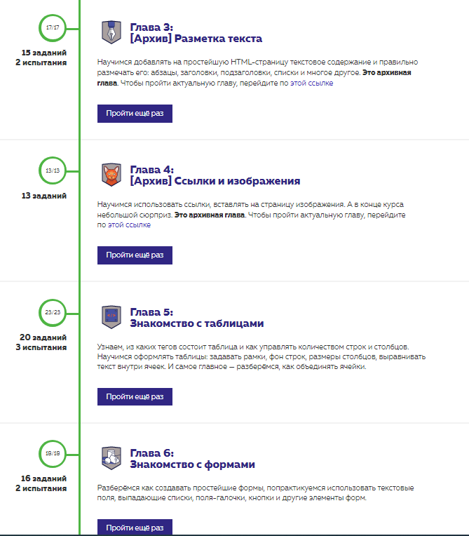
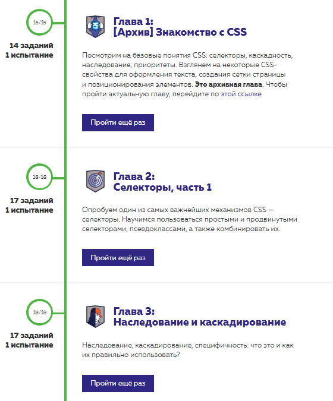

# Intro to HTML and CSS

1. [x] Finish the courses [Intro to HTML & CSS](https://classroom.udacity.com/courses/ud001) and [Basic of HTML](https://htmlacademy.ru/courses/basic-html) [Basic of CSS](https://htmlacademy.ru/courses/basic-css)

### My expressions about the courses:
The htmlacademy courses was the most useful courses that I have ever had. A lot of practice example of html tags,attributes, css selectors and properties. And the best test for testing your knowledge, thanks for this type of online courses!

I will take [Hexlet course](https://ru.hexlet.io/courses/html) from Extra Materials

Screenshots:

