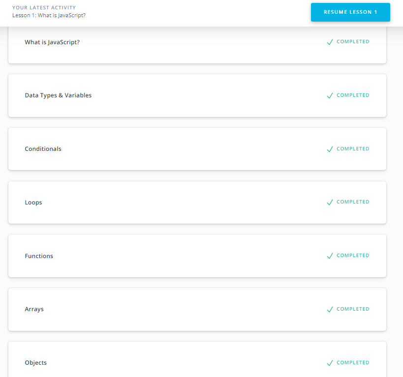

# JavaScript Basics

1. [x] Finish the course [Intro to JS](https://www.udacity.com/course/intro-to-javascript--ud803)

2. [x] FreeCodeCamp exercises. Complete the modules below and save screenshots for each module.
   Use hints available on freecodecamp at each exercise as the first resort when you feel stuck.
   Other helpful devices are materials from **Extra Materials** section below
   and students chat to ask any questions and seek for help.
   - [Basic JavaScript](https://learn.freecodecamp.org/javascript-algorithms-and-data-structures/basic-javascript/) -
     Basic JavaScript language features. ~100 tiny exercises, 2-3 hrs to complete.
   - [ES6 Challenges](https://learn.freecodecamp.org/javascript-algorithms-and-data-structures/es6/) -
     JS ES6 features. Complete initial 19 exercises (till **Write Concise Declarative Functions with ES6**),
     3-4 hrs to complete.
   - [Basic Data Structures](https://learn.freecodecamp.org/javascript-algorithms-and-data-structures/basic-data-structures/) -
     Manipulate arrays and objects. Complete all exercises (20). 3-4 hrs to complete.
   - [Basic Algorithm Scripting](https://learn.freecodecamp.org/javascript-algorithms-and-data-structures/basic-algorithm-scripting/) -
     Basic algorithms. Solve all problems (<20). 4-5 hrs to complete.
   - [Functional Programming](https://learn.freecodecamp.org/javascript-algorithms-and-data-structures/functional-programming/) -
     Complete all exercises (<25). 2-3 hrs to complete.
   - [Algorithm Scripting Challenges](https://learn.freecodecamp.org/javascript-algorithms-and-data-structures/intermediate-algorithm-scripting) -
     Intermediate algorithms. Solve initial 11 problems (till **Convert HTML Entities**), 3-5 hrs to complete.
     - :warning: In [**Pig Latin**](https://learn.freecodecamp.org/javascript-algorithms-and-data-structures/intermediate-algorithm-scripting/pig-latin/)
       exercise English letter **Y** is considered a consonant.
     - :warning: In [**Convert HTML Entities**](https://learn.freecodecamp.org/javascript-algorithms-and-data-structures/intermediate-algorithm-scripting/convert-html-entities)
       exercise **DO NOT** copy-paste HTML entities (`'&amp;'`, `'&lt'` etc.) from the tests
       as those will contain invisible non-breaking spaces and the code won't work as expected. Type them instead.

    ## My expressions about the courses:
    It was really exciting experience. The best part was doing excersices using Algoritm Scripting and Functional Programming. I start to understand JavaScripy better!

    Screenshots:
    
    
