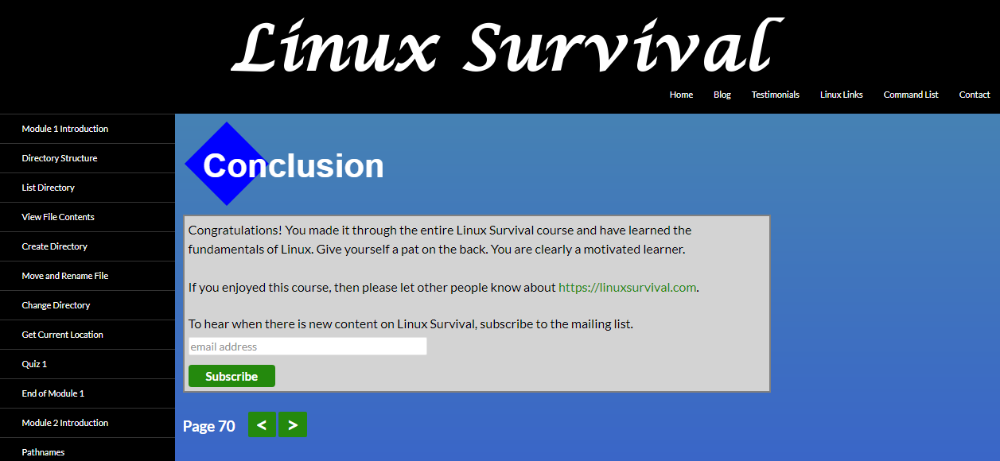

1. [x] Finish the course [Linux Survival (4 modules)](https://linuxsurvival.com/)
2. [x] Read article [HTTP: The Protocol Every Web Developer Must Know - Part 1](https://code.tutsplus.com/tutorials/http-the-protocol-every-web-developer-must-know-part-1--net-31177)
3. [x] Read article [HTTP: The Protocol Every Web Developer Must Know - Part 2](https://code.tutsplus.com/tutorials/http-the-protocol-every-web-developer-must-know-part-2--net-31155)

My reflections on subtasks:

By taking Linux course, I:
* Refreshed my memmory about the most useful bash commands (like ls,mkdir,mv,rm,cp and so on)
* Learned how to examine running processes, to concatenate files or to find pattern in data.

P.S. grep with pipe operator is really powerful

