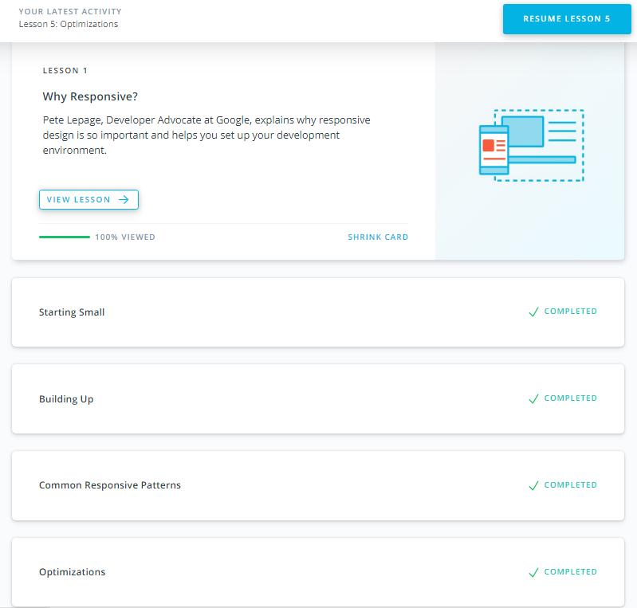
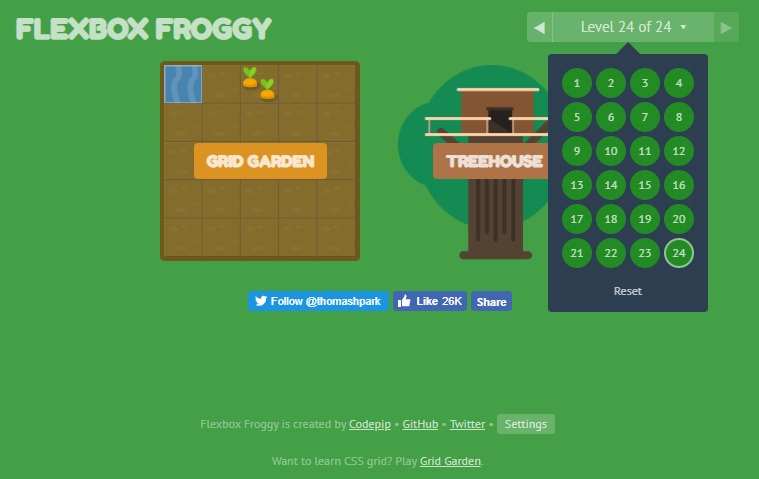

# Responsive Web Design

1. [x] Finish the courses [Responsive Web Design Fundamentals](https://www.udacity.com/course/responsive-web-design-fundamentals--ud893) and
[Flexbox Froggy](http://flexboxfroggy.com/) 

### My expressions about the courses:
Taking these courses helps me a lot to understand why should I use responsive design to all my projects and what kind of web design tools I could use. Also, I had a lot of fun using CSS Flexbox and media queries.

I will take [Flex Zombies](https://mastery.games/p/flexbox-zombies) from Extra Materials

Screenshots:

